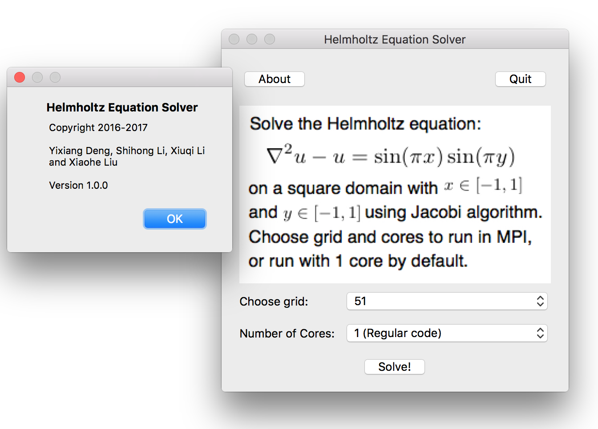
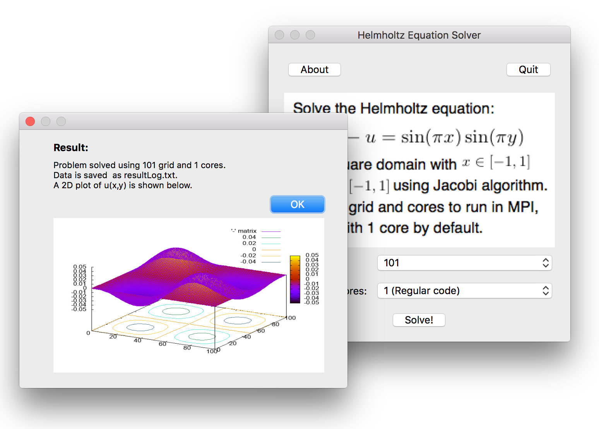

We build an equation solver for Helmholtz equation, and accelerated it using MPI parallel and GPU algorithm.
Our work consists of four parts:
* MPI-Accelerated Solver
* CUDA-Accelerated Solver
* OpenACC-Accelerated Solver
* GUI App of the Solver

=========================================
=========[Basic Solver and MPI-Accelerated Solver]========
=========================================
Work done by Yixiang Deng.

 ********************************
 *Introduction and Overview*

#Helmholtz Equation

$\Delta^2 u + u = \sin(2\pi x)\sin(2\pi y)$

A 2D Helmholtz equation is studied in this project, which is a solved by Jacobi iteration method.

#Jacobi Algorithm

Unlike SOR or Gauss-Seidel method, Jacobi iteration method only uses the value calculated in last step, namely array/matrix uold or u in the cpp files written by Yixiang Deng and newly calculated values are stored in array/matrix unew, respectively. And consequently, Jacobi iteration is more feasible when parallelized.

********************************
 *Instruction on Compilation and How to Run Code*

#(Serial) Helmholtz.cpp

To compile, make sure boost library is installed in your laptop or loaded on ccv.
When compiling on ccv, make sure you type 

   $ module load boost
   $ module load gnuplot

After this, type 

  $ sh compile.sh
  
Then you will get a executable file named “h.out”.

To run, type 

  $ ./h.out 101
  
  ,where the second argument other than the executable file, should be odd to assure the origin locating at (0,0), is the number of nodes user would like to use in the grid, since both dimension use the same number of nodes, we just need one input value.

After running, there will be two main outputs, one is the mygraph.png, which plots the final contour and surface plot of unew, another is the out.txt, which contains the numerical results of unew.

#(MPI) parallel_jacobi.cpp

Log on CCV and type

  $ module load mpich

Then, type 

  $ mpic++ -o exe_file parallel_jacobi.cpp
  
and then an exe_file will be created.

To run the executive file, type 

  $ mpirun -n nproc exe_file 101
  
  where the nproc represents the number pf processor the user would like to use and should be an even number, the argument right after exe_file is the number of nodes in each dimension similar to what is explained above.

After running, the screen will output some information of running, like the exact error, number of iteration and wall-time of each processor. Furthermore, there will be a out.txt, which contains the numerical results of unew.

=========================================
==========[CUDA-Accelerated Solver]==========
=========================================

Work done by Xiuqi Li.

********************************
 *Introduction and Overview*

Our CUDA-accelerated Helmholtz equation solvers includes: 
* Helmholtz_cuda_v1.cu, 
* Helmholtz_cuda_v1_2d.cu
* Helmholtz_cuda_v2.cu
* Helmholtz_cuda_v2_2d.cu.

They are used to solve the same problem. They are all able to caculate the correct result. Some of the versions are faster than others. 
Helmholtz_cuda_v2.cu has the best performance.

Helmholtz_cuda_v1 and Helmholtz_cuda_v1_2d use global memory to store and access data during
caculation on GPU. Helmholtz_cuda_v2 and Helmholtz_cuda_v2_2d use texture memory to access data during caculation on GPU. 

The difference between v1 and v1_2d (or v2 and v2_2d) is that 2d blocks and threads
are used in the latter. 

********************************
 *Instruction on Compilation*
 
For compilation on CCV at Brown University, log on CCV and use the following bash command:

  $ module load cuda/7.5.18
  
  $ nvcc -o [output executable file name] [filename of the cuda code]

**********************
*How to Run Code*

Users can specify three parameters: 
* number of points in each dimension, 
* block dimension on GPU
* grid dimension on GPU.

If the any of the 3 parameters are not specified, default will be used(check code to see how the default is caculated). 
For 1d version, type in 

  $ ./[name of the output file] [number of points in each dimension] [threads per block] [blocks per grid] 
to run. 

For 2d version, type in 

  $./[name of the output file] [number of points in each dimension] [threads per block in each dimension] [blocks per grid in dimension] 
to run.

Data of u(x,y) matrix is stored in the output file "uend.txt". 

Example:
  $ nvcc -o v1 Helmholtz_cuda_v1.cu
  $ ./ v1 201 256 100 

=========================================
=========[OpenACC-Accelerated Solver]========
=========================================

Work done by Shihong Li.

********************************
 *Introduction and Overview*

 OpenACC is a very simple directive-type code for GPU acceleration. Usually programmers can use four steps to optimize their speed-up goal, and we reflect our solver in our code as follows: 
* identify parallelism (See Helmholtz_ACC_step1.cpp), 
* generate parallel code (Helmholtz_ACC_step2.cpp), 
* manage data movement (Helmholtz_ACC_step3cpp),
* control number of threads and blocks (Helmholtz_ACC_final.cpp). 
 Thus, our team decide to walk through these four steps and present all the codes by above four steps.

********************************
 *Instruction on Compilation*

For example, for Helmholtz_ACC_step1.cpp,
copy and paste the following code into command line:
  $ PGC++ -Minfo=accel, -ta=tesla:cude7.5 –o Helmholtz_step1 Helmholtz_ACC_step1.cpp
&& echo “compile successfully!”

Then you shall see acceleration information presented first and if this code is compiled successfully, there will be “compile successfully” shown in the console.

**********************
*How to Run Code*

After compiling, type the following code into command line:
  $ Export=PGI_ACC_TIME=1 && ./Helmholtz_step1.

Then you shall see the directly calculating results presented every 1000 steps, the left column stands for the current iteration steps and the right column stands for the current square root error.  After that you shall see the total runtime presented in the end, together with detailed time usage shown right below, i.e, how much time is spent on GPU calculating, how much on data transferring and how much on CPU.

The other cpp files can be compiled and run in a similar way by simply changing the file names and also the output files names.

=========================================
=============[GUI App of Solver]=============
=========================================

Work done by Xiaohe Liu.

********************************
*Introduction and Overview*

We developed a GUI App on Mac OX desktop using Qt Creater. The app has the following features:
* An "about" button that shows the information about the software,
* A "quit" button,
* An instruction on the PDE problem to solve and the algotithm we use,
* Two combo boxes that allows user to choose grid points and how many cores to use for the MPI code,
* A solve button to call the solving process; A dialogue box of the result will show when the calculation is done.

Screenshots of the App:
About button clicked:

Choose grid points and cores:

Results popped out:

Files in directory GPU_A/HelmholtzEquationSolver/ is the code we used in Qt Creator.

Files in directory GPU_A/build-HelmholtzEquationSolver-Desktop_Qt_5_7_0_clang_64bit-Release/ is the release version.

********************************
*Instruction on Compilation*

The App is Mac OX only and cannot be compiled on CCV.
To compile on Qt Creator on a Mac, open GPU_A/HelmholtzEquationSolver/HelmholtzEquationSolver.pro and hit the run button.

**********************
*How to Run Code*

On a Mac machine, download everything in the GPU_A/build-HelmholtzEquationSolver-Desktop_Qt_5_7_0_clang_64bit-Release/  directory, and click the HelmholtzEquationSolver app icon.

